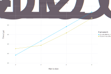
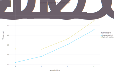

# ScatterNNlib.jl

A scatter operation library for neural network

## Benchmark

Scatter operations are fundamental to ScatterNNlib.jl and they are implemented in CPU and CUDA version. Benchmarks of scatter operations are done with scripts in benchmark folder. Statistics, includes max, min and mean, are shown in the following plots.

Performance of scatter add operations in ScatterNNlib is better than Pytorch_scatter on cuda.

> Version:
> * CUDA 10.2
> * Python 3.7, Pytorch 1.6.0, Pytorch scatter 2.0.5
> * Julia v1.5.0, CUDA v1.2.1, Flux v0.11.0, ScatterNNlib v0.1.1
